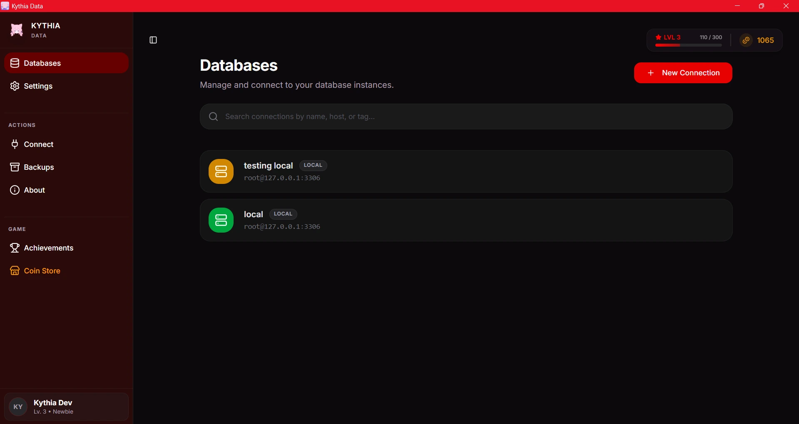

<p align="center">
  <br>
  
  <br>
</p>

<h1 align="center">Kythia Data</h1>

<p align="center">
  <strong>The Next-Generation Native Database Client</strong><br>
  Blazingly fast, lightweight, and delightfully gamified.
</p>

<p align="center">
  <a href="https://github.com/kenndeclouv/kythia-data/blob/main/LICENSE">
    
  </a>
  <a href="https://v2.tauri.app/">
    
  </a>
  <a href="https://www.rust-lang.org/">
    
  </a>
  <a href="https://react.dev/">
    
  </a>
</p>

<p align="center">
  
</p>

---

## What is Kythia Data?

Kythia Data is a modern, ultra-lightweight database client built as a sleek alternative to bloated, heavy tools like DBeaver, DataGrip, or web-based legacy tools like phpMyAdmin. 

Built completely from the ground up using **[Tauri v2](https://v2.tauri.app/)**, **Rust**, and **React**, Kythia Data is designed around three core principles:
1. **Performance**: Minimal RAM consumption and instant startup times (no Java Virtual Machine required).
2. **Native Experience**: Feels right at home on your OS while communicating with databases entirely natively through Rust's robust `sqlx` driver.
3. **Developer Experience**: A gorgeous, snappy UI that makes writing queries, managing tables, and viewing data an absolute joy.

## Features

- **Microscopic Footprint**: Thanks to Rust and the OS-native WebView, Kythia consumes a fraction of the RAM used by Electron or Java-based apps.
- **Native Database Support**: Connect securely and seamlessly. Currently supporting:
  - **MySQL** and **MariaDB**
  - *(PostgreSQL, SQLite, and MongoDB support planned)*
- **Advanced Query Editor**: Write SQL comfortably with syntax highlighting, autocomplete, and lightning-fast execution.
- **Visual Table Management**: Create, alter, and drop tables without writing a single line of SQL.
- **Seamless Data Import & Export**: Dump your entire database or a specific table directly to a `.sql` or `.csv` file instantly.
- **User Management**: Easily manage database users, passwords, and privileges from an intuitive modal.
- **Built-in Gamification**: Level up your developer profile! Earn XP and Kythia Coins by executing queries, creating connections, and unlocking achievements (e.g., "Bobby Tables" for dropping a table). Spend your coins in the Coin Store on custom themes, sound packs (like the Ara Ara voice pack), and exclusive badges. All your stats are tracked in a sleek Profile Dashboard.

## Quick Start

### Prerequisites
- **Windows 10/11** (macOS and Linux support planned)
- [Bun](https://bun.sh/) (Fast all-in-one JavaScript runtime)
- [Rust](https://www.rust-lang.org/tools/install) (For building the core engine)

### Installation

1. **Clone the repository:**
   ```bash
   git clone https://github.com/kenndeclouv/kythia-data.git
   cd kythia-data
   ```
2. **Install dependencies:**
   ```bash
   bun install
   ```
3. **Run in Development Mode:**
   ```bash
   bun tauri dev
   ```
4. **Build Production Installer:**
   ```bash
   bun run build:release
   ```
   *This will generate a `.msi` installer and a `.exe` portable executable in `releases/`.*

## Comprehensive Documentation

To truly master Kythia Data, please read the official documentation:
- [Architecture Details](docs/ARCHITECTURE.md) - Deep dive into how Rust handles SQL execution and IPC.
- [Contributing](CONTRIBUTING.md) - Learn how to build Kythia locally and contribute back to the project.

## Contributing

We welcome community contributions! If you're a Rustacean, a React wizard, or just someone who found a bug, please check out our [Contributing Guidelines](CONTRIBUTING.md).

## License

Kythia Data is proudly open-source and released under the [MIT License](./LICENSE).