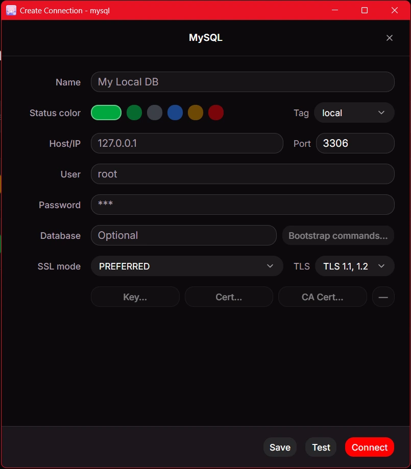
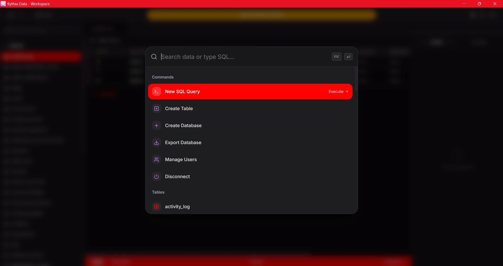
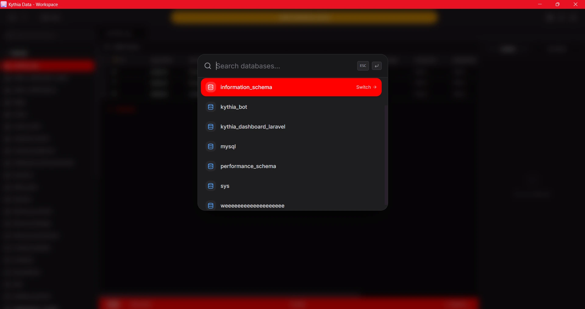
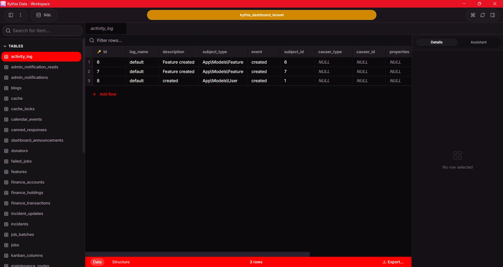
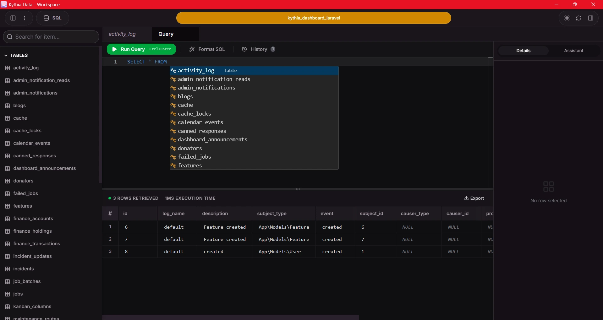
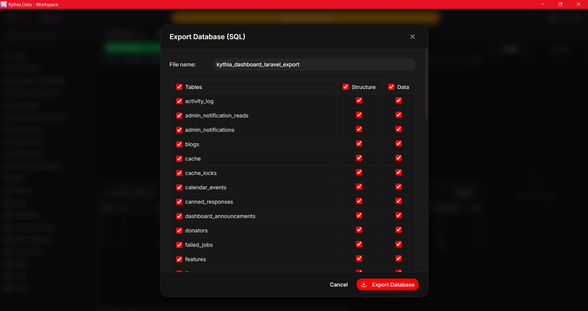

# Usage Guide & User Manual

Welcome to Kythia Data! This manual is designed to get you from absolute zero to managing complex, high-performance database interactions in minutes.

# Usage Guide & User Manual

Welcome to Kythia Data! This manual is designed to get you from absolute zero to managing complex, high-performance database interactions in minutes.

---

## 1. First Launch & Connection

When you open Kythia Data for the first time, you will be greeted by a sleek, empty workspace. Unlike bloated database clients, Kythia Data is lightweight and instantly ready.

### 1.1 Connecting to a Database
1. Launch Kythia Data.
2. Click on the **New Connection** button or use the Omnibar.
3. Select your database type (MySQL, MariaDB, etc.).
4. Enter your connection details (Host, Port, User, Password).
5. Click **Connect**. Kythia Data uses a native Rust driver (`sqlx`) to establish a lightning-fast connection.

---

## 2. Navigating the Workspace

Kythia Data provides a modern, intuitive UI for all your database needs.

### 2.1 The Omnibar
The Omnibar is your command center. Quickly search for tables, execute quick commands, or switch active connections without taking your hands off the keyboard.

### 2.2 Switching Databases
Managing multiple databases on the same server is seamless.
- Use the sidebar or the Omnibar to instantly switch context between different databases.
- The UI updates instantly without any loading spinners thanks to the native Rust backend.

---

## 3. Database Management

### 3.1 Creating a Database
Need a new schema for your project?
1. Right-click on the connection or use the **Create Database** action.
2. Enter the new database name and select the desired collation.
3. Click **Create** and it's instantly available in your sidebar.

### 3.2 Visual Table Management
Create, alter, and drop tables without writing a single line of SQL.
- Click on any table to open the **Table Workspace**.
- Here you can view rows, edit cell values directly, add new columns, and manage indexes.
- Data changes are batched and applied securely.

---

## 4. Writing Queries

For the power users, the SQL Editor is where the magic happens.

- Navigate to the **SQL Editor** tab.
- Write your queries with full syntax highlighting and smart autocomplete.
- Press `Ctrl + Enter` (or `Cmd + Enter` on Mac) to execute.
- Results are displayed in a beautifully formatted, scrollable grid at the bottom.

---

## 5. Importing & Exporting Data

Moving data in and out of your databases is robust and native.

### 5.1 Exporting (Dumps)
1. Select the database or specific tables you want to export.
2. Click **Export**.
3. Choose your format (`.sql` or `.csv`).
4. Kythia Data handles the streaming export directly to your disk, ensuring minimal memory usage even for massive datasets.

---

## 6. Developer Gamification

Just like other Kythia products, Kythia Data turns mundane local development into a rewarding experience!

- **Earning XP & Coins**: Every time you execute a successful query, create a database, export tables, or unlock secret achievements (like dropping a table or logging in as `root`), you earn XP and Kythia Coins.
- **The Coin Store**: Spend your hard-earned Coins on cosmetics to personalize your client. You can purchase gorgeous UI Themes, Sound Packs (like the *Ara Ara Voice Pack*), and exclusive Title Badges.
- **Achievements & Sound Effects**: Unlock special milestones for your database mastery. Feel the satisfaction of unlocking an achievement with instant toast notifications and custom sound effects.
- **Profile & Progression**: Track your Level and active titles in the sleek Profile dashboard.

*(Note: Developer Gamification features are continuously being expanded in upcoming updates!)*
